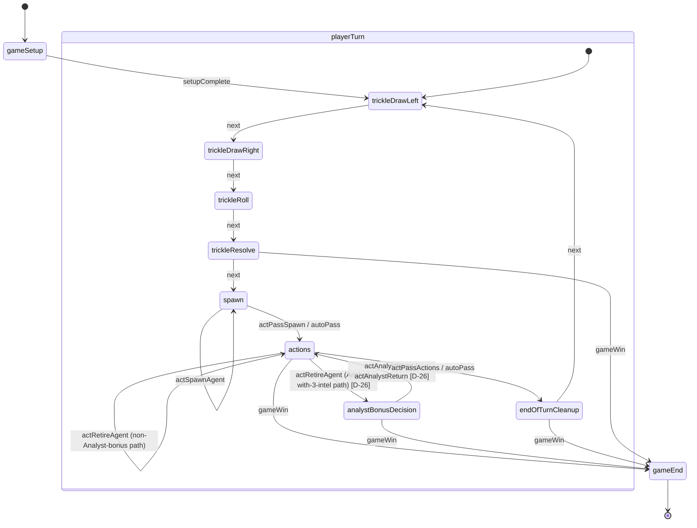

# Hexpionage — BGA State Machine (A5 Output)

> **Purpose**: canonical specification of the BGA Studio state machine for Hexpionage. Defines every state, its type, args/possibleactions/transitions contracts, on-entering / on-leaving callbacks, undo policy, zombie behavior, and the notifications each state fires. This document is the input to A7 (`states.inc.php` or `modules/php/States/`), A11 (`CONTRACT.md` notifications schema), and A6 (`UI_SPEC.md`, which renders state-args).
>
> **Scope**: state machine and action routing only. **Out of scope**: handler bodies (A7), DDL (A4), UI rendering (A6), notification payload schemas (A11; this doc lists names + intent only).
>
> **Source-of-truth dependency order**: `rulebook.md` → `DECISIONS.md` → `specs/STATE_MODEL.md` → `specs/BGA_PRIMER.md` → this doc. Citations inline as `§N.N` (rulebook), `[D-NN]` (decisions), `STATE_MODEL §N` (state model doc), `BGA_PRIMER §N` (primer doc).
>
> **Framework choice**: see §10 — **modern (PHP state classes + `#[PossibleAction]`)** is recommended and assumed throughout.

---

## 0. Conventions

- **State IDs**: camelCase per BGA convention; in the modern framework each state ID is also a class name (e.g., `class Spawn extends GameState`).
- **State types**: `game` (auto / `GAME`), `activeplayer` (`ACTIVE_PLAYER`), `multiactiveplayer` (unused here), `end` (terminal, BGA reserved id `99`). [BGA_PRIMER §3]
- **Transition keys** (`next`, `pass`, `gameWin`, `zombiePass`, `autoPass`) are framework-neutral names; per-state tables list target-state IDs.
- **Action names**: this spec uses camelCase (`actSpawnAgent`, etc.) per BGA convention. The rulebook §6 uses snake_case; A7 aliases via the `#[PossibleAction]` method name.
- **Notifications**: server emits via `notify->all` or `notify->player` (BGA_PRIMER §4). A11 owns full payload schemas; this doc lists names + visibility.
- Hex coordinates: pointy-top axial `(q, r)` per STATE_MODEL §3.

---

## 1. State Diagram



Notes:
- `playerTurn` is a logical composite for readability; BGA does not have hierarchical states. In the modern framework it is a flat list of states with `endOfTurnCleanup → trickleDrawLeft` looping back for the next player after swapping `active_player_id`.
- `gameWin` exits fire from `actions` (inline retire-scores-20 per §6.5), `endOfTurnCleanup` (canonical depletion check per §7.4 step 5 / [D-17]), and `trickleResolve` (defensive depletion check when a Honeypot trickle eats a player's last agent).
- Every active-player state carries a `zombiePass` transition (BGA_PRIMER §3).

---

## 2. State Table

Each subsection below specifies one state. Schema:

| Field | Meaning |
|---|---|
| `id` | camelCase state name. Also a class name in modern framework. |
| `type` | `game` (auto), `activeplayer`, `end`. |
| `name` | Human-readable; appears in BGA log lines. |
| `description` | One-line description (also serves as `description` in `states.inc.php`). |
| `descriptionmyturn` | Active-player view (only meaningful for `activeplayer` states). |
| `args` contract | What `args()` returns to the client; what data the UI needs to render this state. |
| `possibleactions` | Which `act*` methods are legal here. Modern: `#[PossibleAction]` on those methods. |
| `transitions` | `event_name → next_state_id` map. |
| `onEnteringState` | Server-side work fired on entry. May redirect by returning a transition name (modern). |
| `onLeavingState` | Cleanup work on exit. Usually empty for game-flow states. |
| `undo_allowed` | Y / N / scoped (see §5 undo policy). |
| `zombie_behavior` | What server does if active player goes zombie. |
| `notifications` | List of notification names emitted by handlers in this state (input to A11). |

### 2.1 `gameSetup`

| Field | Value |
|---|---|
| `id` | `gameSetup` (BGA reserved id `1` per BGA_PRIMER §3) |
| `type` | `game` |
| `name` | `clienttranslate('Game setup')` |
| `description` | `'Initializing game'` |
| `args` contract | None (BGA does not call `args()` for setup). |
| `possibleactions` | none |
| `transitions` | `setupComplete → trickleDrawLeft` |
| `onEnteringState` | After framework's `setupNewGame()` runs (per STATE_MODEL §8 + BGA_PRIMER §2), emit `gameStarted` notification (`{first_player_id, bag_size, board_layout}` — no hidden info), then return `'setupComplete'`. See §8.1 for full contract. |
| `onLeavingState` | None. |
| `undo_allowed` | N — would unreveal first-player random pick and shuffle. |
| `zombie_behavior` | n/a (no active player). |
| `notifications` | `gameStarted` (public). |

### 2.2 `trickleDrawLeft`

| Field | Value |
|---|---|
| `id` | `trickleDrawLeft` |
| `type` | `game` |
| `name` | `clienttranslate('Drawing intel (left)')` |
| `description` | `'Drawing left-side intel'` |
| `args` contract | None. |
| `possibleactions` | none |
| `transitions` | `next → trickleDrawRight` |
| `onEnteringState` | Per §5.1 step 1 + [D-18] (skip if `bag_size == 0`); pick via `bga_rand`; place on top-left intel-entry hex; emit `intelDrawn`; return `'next'`. Full contract §8.2. |
| `undo_allowed` | N — bag draw reveals previously hidden info. |
| `zombie_behavior` | n/a. |
| `notifications` | `intelDrawn` (public; reveals type per §10.2, intentional). |

### 2.3 `trickleDrawRight`

| Field | Value |
|---|---|
| `id` | `trickleDrawRight` |
| `type` | `game` |
| `name` | `clienttranslate('Drawing intel (right)')` |
| `description` | `'Drawing right-side intel'` |
| `args` contract | None. |
| `possibleactions` | none |
| `transitions` | `next → trickleRoll` |
| `onEnteringState` | Same as §2.2 with top-right hex; emits `intelDrawn` with `side: 'right'`. See §8.3. |
| `undo_allowed` | N. |
| `zombie_behavior` | n/a. |
| `notifications` | `intelDrawn` (public). |

### 2.4 `trickleRoll`

| Field | Value |
|---|---|
| `id` | `trickleRoll` |
| `type` | `game` |
| `name` | `clienttranslate('Rolling intel dice')` |
| `description` | `'Rolling 6 intel dice'` |
| `args` contract | None. |
| `possibleactions` | none |
| `transitions` | `next → trickleResolve` |
| `onEnteringState` | Per §5.1 step 3: roll all 6 dice via `bga_rand(1,2)` (1=odd→`SW`, 2=even→`SE`); persist to `globals.dice_state`; emit `diceRolled` (public per §10.5); return `'next'`. Full contract §8.4. |
| `undo_allowed` | N — dice are hidden-info reveals. |
| `zombie_behavior` | n/a. |
| `notifications` | `diceRolled` (public). |

### 2.5 `trickleResolve`

| Field | Value |
|---|---|
| `id` | `trickleResolve` |
| `type` | `game` |
| `name` | `clienttranslate('Resolving trickle')` |
| `description` | `'Resolving intel movement'` |
| `args` contract | None. |
| `possibleactions` | none |
| `transitions` | `next → spawn`; `gameWin → gameEnd` |
| `onEnteringState` | Runs §7.2 algorithm under one DB transaction (STATE_MODEL §7.4): move computation, blockade redirect (§9.6.A/C/D), simultaneous apply, off-board returns (§9.2), agent possession (Honeypot first per §9.3 EDGE O-01, pickup, over-capacity §9.3), depletion check ([D-17]). Emits one batched `trickleResolved` notification (BGA_PATTERNS pattern 3); returns `'next'` or `'gameWin'`. Full contract §8.5. |
| `undo_allowed` | N — Honeypot identity is resolved against agent positions. |
| `zombie_behavior` | n/a. |
| `notifications` | `trickleResolved` (public; batched). Optional split form: `agentRemoved`, `agentDumped`. |

### 2.6 `spawn`

| Field | Value |
|---|---|
| `id` | `spawn` |
| `type` | `activeplayer` (decision: see §11 below — single active player, **not** multiactive) |
| `name` | `clienttranslate('${actplayer} must spawn agents')` |
| `description` | `'${actplayer} must spawn agents (or pass)'` |
| `descriptionmyturn` | `'${you} must spawn agents (or pass)'` |
| `args` contract | See §7.1. Summary: `{available_agents_in_pool, available_spawn_hexes, current_on_board_count, spawn_cap_remaining, can_pass: true}`. |
| `possibleactions` | `actSpawnAgent`, `actPassSpawn` |
| `transitions` | `actSpawnAgent → spawn` (self-loop); `actPassSpawn → actions`; `autoPass → actions` (when `spawn_cap_remaining == 0 OR pool_empty OR no_legal_hex`); `zombiePass → actions` |
| `onEnteringState` | Compute `args()`; if no legal spawn exists, return `'autoPass'`. Call `$this->undoSavepoint()` on first entry to enable spawn-undo (BGA_PRIMER §2). |
| `undo_allowed` | **Y, scoped within `spawn` phase.** Spawn placements reveal no hidden info; undo permitted up to `actPassSpawn`. |
| `zombie_behavior` | Server fires `actPassSpawn`. |
| `notifications` | `agentSpawned` (public, one per `actSpawnAgent`). |

### 2.7 `actions`

| Field | Value |
|---|---|
| `id` | `actions` |
| `type` | `activeplayer` |
| `name` | `clienttranslate('${actplayer} must take actions')` |
| `description` | `'${actplayer} must take actions (${actions_remaining} remaining)'` |
| `descriptionmyturn` | `'${you} must take actions (${actions_remaining} remaining)'` |
| `args` contract | See §7.2. Summary: `{actions_remaining (0..4), smuggler_boost_used_this_turn, legal_actions[...], can_pass: true}`. |
| `possibleactions` | All 14 action-phase methods per §3 mapping table: `actMoveAgent`, `actTransferIntel`, `actRetireAgent`, `actEngineerPlaceBlockadeAdjacent`, `actEngineerPlaceBlockadeAnywhere`, `actSmugglerBoostActions`, `actSmugglerSwapAgents`, `actCommsMoveIntelUp`, `actCommsMoveIntelDown`, `actDoubleAgentTransfer`, `actHackerPin`, `actHackerUnpin`, `actHackerStealIntel`, `actPassActions`. |
| `transitions` | All 13 acting actions self-loop to `actions`; `actPassActions → endOfTurnCleanup`; `autoPass → endOfTurnCleanup` (per §6.13 auto-pass rule when `actions_remaining == 0 AND no intel-only ability legal AND no Retire legal`); `gameWin → gameEnd` (any retire that pushes score ≥ 20); `zombiePass → endOfTurnCleanup`. |
| `onEnteringState` | **First entry** from `spawn` (or from `analystBonusDecision` per [D-26]): if `globals.actions_phase_initialized != current_turn_id`, set `globals.actions_remaining = 3` (§6.2 effect), set `globals.actions_phase_initialized = current_turn_id`, and call `$this->undoSavepoint()`. **Self-loop entry**: do NOT touch `actions_remaining`; only rebuild `args()`. The discriminator is the per-turn flag `actions_phase_initialized` (NOT a `globals.actions_remaining == 0` test, which is unsafe — see F-09 / F-18). Per-action handlers decrement `actions_remaining`, update per-turn flags, and check auto-pass post-effect. See §11.4. |
| `undo_allowed` | **Y per-action, except `actRetireAgent` after Analyst bonus draws.** See §5.1 sub-table. |
| `zombie_behavior` | Server fires `actPassActions`. |
| `notifications` | One per action; see §9. |

### 2.7b `analystBonusDecision` [D-26]

| Field | Value |
|---|---|
| `id` | `analystBonusDecision` |
| `type` | `activeplayer` |
| `name` | `clienttranslate('${actplayer} must decide on Analyst bonus')` |
| `description` | `'${actplayer} must keep or return the Analyst bonus tile'` |
| `descriptionmyturn` | `'${you} must keep or return the Analyst bonus tile'` |
| `args` contract | `{ player_id: <active_player_id> }` (public). The `tile_id`/`type_id`/`score_value` are NOT in `args()` — they are sent to the active player only via the private `analystBonusDrawn` notification fired in `onEnteringState` (per [D-20]). |
| `possibleactions` | `actAnalystKeep`, `actAnalystReturn` [D-26] |
| `transitions` | `actAnalystKeep → actions` (or `gameEnd` via `gameWin` if score ≥ 20); `actAnalystReturn → actions` (or `gameEnd` via depletion `gameWin`); `zombiePass → actions` (auto-fires `actAnalystReturn`). |
| `onEnteringState` | Per [D-26] step 4: server draws the bonus tile from the bag (`bga_rand`) — or skips entirely if `bag_size == 0` per [D-18], in which case fire `analystBonusSkipped` and immediately return `'next'` to bypass this state. Otherwise, fire `analystBonusDrawn` privately to the active player (per [D-20]; payload `{tile_id, type_id, score_value, new_bag_size}`). Persist the drawn tile id in `globals.analyst_bonus_pending_tile_id` so the action handler can act on it. Wait for player input. |
| `onLeavingState` | Clear `globals.analyst_bonus_pending_tile_id`. |
| `undo_allowed` | **N** — undoing would re-roll the random `bga_rand` draw. The savepoint is dropped before the draw fires. [D-26] |
| `zombie_behavior` | Auto-fire `actAnalystReturn` (the safe default — no score change, no bag-composition leak). [D-26] |
| `notifications` | `analystBonusDrawn` (private to active per [D-20]); `analystBonusKept` (public; reveals type per [D-20]); `analystBonusReturned` (public; carries only `player_id` per [D-20]); `analystBonusSkipped` (public; empty-bag case per [D-18]); follow-up `scoreUpdated` (public, on `keep`). |

> **Why a separate state (per [D-26])**: the previous design (blind pre-commit on the `actRetireAgent` payload) deprived the player of informed choice (see F-13 / D-26-CANDIDATE in QA review). Splitting into a sub-state lets the server reveal the drawn tile to the active player (privately per [D-20]) before collecting the keep/return decision.

### 2.8 `endOfTurnCleanup`

| Field | Value |
|---|---|
| `id` | `endOfTurnCleanup` |
| `type` | `game` |
| `name` | `clienttranslate('End of turn')` |
| `description` | `'End-of-turn cleanup'` |
| `args` contract | None. |
| `possibleactions` | none |
| `transitions` | `next → trickleDrawLeft`; `gameWin → gameEnd` |
| `onEnteringState` | Runs §7.4 cleanup in order: (1) pin expiry [D-06a]; (2) blockade expiry [D-07]; (3) reset per-turn flags (smuggler boost, spawned-this-turn, per-Hacker flags, dice_state); (4) redundant 20-point win check; (5) depletion check [D-17]; (6) increment `turn_id`, flip `active_player_id`, return `'next'`. Full contract §8.6. |
| `undo_allowed` | N — server-driven; no player-decision boundary. |
| `zombie_behavior` | n/a. |
| `notifications` | `pinExpired`, `blockadeExpired` (both batched, possibly empty), `turnEnded` (all public). |

### 2.9 `gameEnd`

| Field | Value |
|---|---|
| `id` | `gameEnd` (BGA reserved id `99` per BGA_PRIMER §3) |
| `type` | `end` |
| `name` | `clienttranslate('End of game')` |
| `description` | `'End of game'` |
| `descriptionmyturn` | n/a |
| `args` contract | None. The framework uses `getGameProgression()` and the score table for the end-game UI. |
| `possibleactions` | none |
| `transitions` | none (terminal) |
| `onEnteringState` | Emit `gameEnded` notification (public; `{winner_id, win_reason: 'score_20'\|'depletion'}`). Set BGA player scores via `Stats::setStat()` and the `player_score` column. The framework auto-runs end-of-game scoring screens. |
| `onLeavingState` | n/a. |
| `undo_allowed` | N. |
| `zombie_behavior` | n/a. |
| `notifications` | `gameEnded` (public). |

---

## 3. Action → State Mapping

Every `act*` action from rulebook.md §6 is legal in **exactly one** state.

| Action (camelCase) | § | State | Cost (Action / Intel) | Per-turn cap |
|---|---|---|---|---|
| `actSpawnAgent` | §6.1 | `spawn` | 0 / 0 | cap = `3 - on_board_count` |
| `actPassSpawn` | §6.2 | `spawn` | 0 / 0 | once (terminal) |
| `actMoveAgent` | §6.3 | `actions` | 1A / 0 | unlimited |
| `actTransferIntel` | §6.4 | `actions` | 1A / 0 | unlimited |
| `actRetireAgent` | §6.5 | `actions` | FREE | unlimited |
| `actEngineerPlaceBlockadeAdjacent` | §6.6.A | `actions` | 1A / 0 | gated by `<3` blockade cap |
| `actEngineerPlaceBlockadeAnywhere` | §6.6.B | `actions` | 0 / 1I | gated by blockade cap + intel |
| `actSmugglerBoostActions` | §6.7 | `actions` | 0 / 1I | once per **player** [D-08] |
| `actSmugglerSwapAgents` | §6.8 | `actions` | 1A / 1I | unlimited |
| `actCommsMoveIntelUp` | §6.9.A | `actions` | 1A / 0 | unlimited |
| `actCommsMoveIntelDown` | §6.9.B | `actions` | 1A / 1I | unlimited |
| `actDoubleAgentTransfer` | §6.10 | `actions` | 1A / 0 | unlimited |
| `actHackerPin` | §6.11.A | `actions` | 1A / 0 | once per **Hacker** (shared w/ unpin) [D-15] |
| `actHackerUnpin` | §6.11.B | `actions` | 1A / 0 | once per **Hacker** (shared w/ pin) [D-15] |
| `actHackerStealIntel` | §6.11.C | `actions` | 0 / 1I | once per **Hacker** (separate slot) [D-15] |
| `actAnalystKeep` | §6.12 | `analystBonusDecision` | 0 / 0 | terminal (per `actRetireAgent` invocation) [D-26] |
| `actAnalystReturn` | §6.12 | `analystBonusDecision` | 0 / 0 | terminal (per `actRetireAgent` invocation) [D-26] |
| `actPassActions` | §6.13 | `actions` | 0 / 0 | once (terminal) |

(`A` = Action point; `I` = Intel tile.) Snake-case rulebook names alias to these camelCase methods via `#[PossibleAction]`.

### 3.1 `actAnalystRetireBonus` is now a two-step sub-state flow [D-26]

> **Revised per [D-26]**: previously the Analyst bonus draw was modeled as a sub-step of `actRetireAgent` with a blind pre-commit `analyst_keep_decision` on the payload. This forced the player to choose keep/return BEFORE seeing the drawn tile (F-13 / D-26-CANDIDATE in QA review). The revised flow uses a dedicated `analystBonusDecision` state.

Per rulebook §6.5 effect 2 and §6.12, the Analyst bonus is now a **dedicated sub-state**, with two new actions (`actAnalystKeep`, `actAnalystReturn`). The decision is collected AFTER the server reveals the tile to the active player (privately per [D-20]).

### 3.2 `actRetireAgent` flow — revised per [D-26]

Standard payload: `{ agent_id }`. (No `analyst_keep_decision` field — removed per [D-26].)

Server-side flow when handling `actRetireAgent`:
1. Validate preconditions (§6.5).
2. Score all held intel per [D-14]; clear `intel_held`; remove agent.
3. Run win check (score ≥ 20 → `gameWin`).
4. If the retired agent was an **Analyst with exactly 3 intel held at the moment of retirement**:
   - If `bag_size == 0` per [D-18]: fire `analystBonusSkipped` (public); proceed to step 5.
   - Else: transition to `analystBonusDecision` state. The new state's `onEnteringState` performs the random bonus draw and fires the private `analystBonusDrawn` notification.
5. Otherwise (or after `analystBonusDecision` resolves): run depletion check ([D-17]); transition back to `actions` (or `gameEnd`).

> **Note**: the `actRetireAgent` action itself remains undoable up to the moment a transition to `analystBonusDecision` occurs (the bonus draw is the irreversible step). Once in `analystBonusDecision`, neither `actAnalystKeep` nor `actAnalystReturn` is undoable. See §5.1.

---

## 4. End-Game Detection Rule

| Trigger | Rulebook § | Firing state | Transition |
|---|---|---|---|
| `active_player.score >= 20` after held-intel scoring in `actRetireAgent` | §8.1 / §6.5 effect 7 | `actions` | `actions → gameEnd` (`gameWin`) |
| `active_player.score >= 20` after `actAnalystKeep` per [D-26] | §8.1 / §6.12 effect 3 | `analystBonusDecision` | `analystBonusDecision → gameEnd` (`gameWin`) |
| Active-player depletion after retire / honeypot move | §8.3 / [D-17] | `actions` (inline), `endOfTurnCleanup` (canonical) | `gameWin` |
| Opponent depletion after Honeypot trickle | §8.3 / [D-17] | `trickleResolve` | `trickleResolve → gameEnd` (`gameWin`) |
| Canonical depletion check (every turn end) | §7.4 step 5 / [D-17] | `endOfTurnCleanup` | `endOfTurnCleanup → gameEnd` (`gameWin`) |

**Inline implementation**: each action handler that mutates score or removes an agent ends with a `if (game_winner now set) return 'gameWin'` short-circuit. The framework routes the transition.

**Tie-breaker [D-03]**: active player wins if both would cross 20 in the same turn (functionally impossible because score only mutates on active player's actions; rulebook §8.2).

**Simultaneous depletion (rulebook §8.3 edge)**: in `endOfTurnCleanup` step 5, iterate `[active_player, opponent]` so the active player's depletion is detected first and the opponent wins.

**Stall**: per rulebook §13 B-01-rev, no stall-detection rule. Game continues until 20 points or [D-17] depletion fires.

---

## 5. Undo Policy per State

Per BGA_PRIMER §2 (transactions/undo savepoints) and the BGA Undo policy: undo must not unreveal hidden info and must keep the same active player. Hexpionage's hidden-info state is the bag (and dice, while rolling).

| State | `undo_allowed` | Rationale |
|---|---|---|
| `gameSetup` | N | Setup runs `bga_rand` for first-player pick and shuffles the bag; undoing would re-roll. [BGA_PRIMER §2] |
| `trickleDrawLeft` | N | Each draw reveals a previously-hidden bag tile (§10.2). Undoing would unreveal it. |
| `trickleDrawRight` | N | Same as above. |
| `trickleRoll` | N | Dice rolls are hidden until the roll fires; undoing re-rolls and breaks determinism. |
| `trickleResolve` | N | Resolves Honeypot identity against agent positions; reveals which trickle tile was the Honeypot. Undo would unreveal. |
| `spawn` | **Y, scoped within phase** | Spawn placements reveal no hidden info: the agent identity is the player's choice from a public pool; the target hex is public. Player can undo each spawn until they pass. Implementation: call `$this->undoSavepoint()` on entry; undo restores to the savepoint (re-empties placements). After `actPassSpawn` fires, the savepoint is gone. |
| `actions` | **Y, per-action with caveats — see §5.1 below** | Most actions reveal no hidden info; some do. |
| `analystBonusDecision` | **N** [D-26] | Undoing would re-roll the random `bga_rand` bonus draw. |
| `endOfTurnCleanup` | N | No player decision boundary; cleanup is automatic. |
| `gameEnd` | N | Terminal. |

### 5.1 Per-action undo policy within `actions`

Undo legality is governed by whether the action reveals previously-hidden info. All 13 acting actions in `actions` are **undoable** EXCEPT `actRetireAgent` once an Analyst bonus has been drawn (the bonus draw reveals a previously-in-bag tile, §6.12).

| Action | Undo |
|---|---|
| `actMoveAgent`, `actTransferIntel`, `actEngineerPlaceBlockadeAdjacent`, `actEngineerPlaceBlockadeAnywhere`, `actSmugglerBoostActions`, `actSmugglerSwapAgents`, `actCommsMoveIntelUp`, `actCommsMoveIntelDown`, `actDoubleAgentTransfer`, `actHackerPin`, `actHackerUnpin`, `actHackerStealIntel` | **Y** — all targets and effects involve already-public state per §3.7 / §10.4. |
| `actRetireAgent` (no bonus, or Analyst with <3 intel) | **Y** — held intel and scoring are public. |
| `actRetireAgent` (Analyst with 3 intel; transitions to `analystBonusDecision`) | **N once the transition fires** — drop savepoint before transitioning per [D-26], because the next step (`onEnteringState` of `analystBonusDecision`) does the `bga_rand` draw. |
| `actAnalystKeep` / `actAnalystReturn` (within `analystBonusDecision`) | **N** — the bonus has already been drawn (in `analystBonusDecision.onEnteringState`); undoing would re-roll. Per [D-26]. |
| `actPassActions` | **N** — terminal; savepoint gone with state transition. |

Note: Hacker steal is undoable because held intel is public per rulebook §3.7 / §10.4. Move-to-Honeypot is undoable because the Honeypot's identity was already public on the board.

### 5.2 Undo implementation pattern

Set `'db_undo_support' => true` in `gameinfos.jsonc`. Sequence in `actions`:
1. On state first-entry: `$this->undoSavepoint()`.
2. Start of each undoable action handler: `$this->undoSavepoint()` (overwrites previous; single-step undo).
3. In `actRetireAgent` for an Analyst with 3 intel: call `$this->undoSavepoint()` AFTER the `bga_rand` bonus draw, making the draw irreversible.

`undoRestorePoint()` rolls back; client calls `$this->gamestate->reloadState()` after. Multi-step undo is a stretch goal.

---

## 6. Zombie / Timeout Handling

Game-flow states (`gameSetup`, all trickle states, `endOfTurnCleanup`, `gameEnd`) have no active player and no zombie behavior.

| Active-player state | Zombie behavior | Transition |
|---|---|---|
| `spawn` | `Spawn::zombie()` fires `actPassSpawn` (zero spawns this turn). | `zombiePass → actions` |
| `actions` | `Actions::zombie()` sets `globals.actions_remaining = 0` and fires `actPassActions`. All other player state is preserved as-is. | `zombiePass → endOfTurnCleanup` |
| `analystBonusDecision` [D-26] | `AnalystBonusDecision::zombie()` auto-fires `actAnalystReturn` (the safer default — no score change, no leak). | `zombiePass → actions` |

Per BGA_PRIMER §11 pitfall: never read `getCurrentPlayerId()` inside a zombie handler. There is no Hexpionage-specific zombie-victory rule; if both players zombie, BGA terminates the table.

---

## 7. State-Args Contracts

For each `activeplayer` state, this section gives the exact `args()` return shape.

### 7.1 `args()` for `spawn`

```json
{
  "available_agents_in_pool": [{"agent_id": 5, "type_id": 1}, ...],
  "available_spawn_hexes": [{"q": 0, "r": 3}, ...],
  "current_on_board_count": 2,
  "spawn_cap_remaining": 1,
  "can_pass": true
}
```

- `available_agents_in_pool`: agents with `state=in_pool` for the active player; `type_id` included for UI labeling.
- `available_spawn_hexes`: every `✦` hex empty of agent / loose intel / blockade (§6.1 / §9.8 preconditions).
- `current_on_board_count`: `COUNT(agent WHERE owner=P AND state=on_board)` (STATE_MODEL §6).
- `spawn_cap_remaining`: `3 - current_on_board_count`.
- `can_pass`: always `true` (per rulebook §5.2; player may always pass spawn).

If `available_agents_in_pool.empty() OR available_spawn_hexes.empty() OR spawn_cap_remaining == 0`, `onEnteringState` returns `'autoPass'` to short-circuit to `actions` (per §2.6).

### 7.2 `args()` for `actions`

Top-level shape:
```json
{
  "actions_remaining": 3,
  "smuggler_boost_used_this_turn": false,
  "active_player_id": 12345,
  "can_pass": true,
  "legal_actions": [ /* one entry per legal action; see below */ ]
}
```

Each `legal_actions[i]` entry has shape `{ "name": "actX", ...per-action fields }`:

| Action name | Per-action fields |
|---|---|
| `actMoveAgent` | `agents: [{agent_id, legal_targets: [hex...]}]` (only un-pinned friendly agents with ≥1 legal target) |
| `actTransferIntel` | `transfers: [{source_agent_id, target_agent_id, transferable_intel_ids: [tile_ids]}]` (adjacent friendly pairs with intel on source) |
| `actRetireAgent` | `agents: [{agent_id, is_analyst_with_3_intel: bool, expected_score_delta: int}]` (un-pinned, on ✦ hex, not spawned this turn) |
| `actEngineerPlaceBlockadeAdjacent` | `engineers: [{agent_id, legal_target_hexes: [hex...]}]` (gated by `<3` blockade cap) |
| `actEngineerPlaceBlockadeAnywhere` | `engineers: [{agent_id, intel_paid_options: [tile_ids], legal_target_hexes: [hex...]}]` |
| `actSmugglerBoostActions` | `smugglers: [{agent_id, intel_paid_options: [tile_ids]}]` (only when `smuggler_boost_used_this_turn == false`) |
| `actSmugglerSwapAgents` | `smugglers: [{agent_id, intel_paid_options: [tile_ids], legal_pairs: [[a, b]]}]` (neither pinned) |
| `actCommsMoveIntelUp` | `moves: [{comms_agent_id, intel_id, legal_targets: [hex...]}]` (loose intel only; target empty of agent and blockade) |
| `actCommsMoveIntelDown` | `moves: [{comms_agent_id, intel_paid_options: [tile_ids], intel_id, legal_targets: [hex...]}]` |
| `actDoubleAgentTransfer` | `double_agents: [{agent_id, transferable_intel_ids: [tile_ids], legal_target_agents: [agent_ids]}]` (no adjacency) |
| `actHackerPin` | `hackers: [{agent_id, legal_target_agents: [agent_ids]}]` (per-Hacker `hacker_pin_used_this_turn == 0`) |
| `actHackerUnpin` | `hackers: [{agent_id, legal_target_agents: [agent_ids]}]` (shares the pin slot per [D-15]) |
| `actHackerStealIntel` | `hackers: [{agent_id, intel_paid_options: [tile_ids], legal_targets: [{target_agent_id, stealable_intel_ids: [tile_ids]}]}]` (per-Hacker `hacker_steal_used_this_turn == 0`) |

**Construction rule**: a `legal_actions[i]` entry is included **iff** at least one legal invocation of that action exists. Empty per-action arrays are omitted, so the UI button bar can disable buttons by absence.

**Construction performance**: computing `legal_actions` is O(|agents on board| × |hexes|) at worst, well under 1000 ops in practice. Recomputed on every entry to `actions` (initial entry + every self-loop).

> **TODO(args-1)**: If A6 (UI spec) finds the payload too large for BGA's 128KB notification cap (BGA_PRIMER §4), split into smaller args invocations: (a) initial `args()` with high-level affordances, (b) on-demand client-server pings to fetch per-agent legal-target lists when the player picks an agent. Default in this spec: ship the full payload; revisit only if size becomes a problem.

### 7.3 `args()` for game-flow states

`gameSetup`, `trickleDrawLeft`, `trickleDrawRight`, `trickleRoll`, `trickleResolve`, `endOfTurnCleanup`, `gameEnd`: no `args()` needed. The state has no active player and no input. The `description` string is enough for the UI to render a status banner.

---

## 8. `onEnteringState` Callbacks

For game-flow (auto) states, the on-entering callback does work and immediately transitions. For active-player states, the callback computes args and waits.

### 8.1 `gameSetup.onEnteringState` (or `setupNewGame()` invoked by framework)

Per STATE_MODEL §8 — sets up players, 24 agents, 47 intel tiles, 0 blockades; picks first player via `bga_rand` per [D-16]; sets `globals.phase = 'trickle_draw_left'`, `turn_id = 1`. Emits `gameStarted`. Returns `'setupComplete'`.

### 8.2 `trickleDrawLeft.onEnteringState`

Per §5.1 step 1: compute `bag_size = COUNT(intel_tile WHERE state IN (in_bag, returned_to_bag))`. If 0, skip per [D-18] (no notification fired; A11 may opt for an empty `intelDrawn` for UI consistency). Else pick one tile via `bga_rand(1, bag_size)`, set `state = on_board, hex = TOP_LEFT`, emit `intelDrawn` (`{tile_id, type_id, hex, side: 'left', new_bag_size}`). Return `'next'`.

### 8.3 `trickleDrawRight.onEnteringState`

Same as 8.2 with `TOP_RIGHT` and `side: 'right'`.

### 8.4 `trickleRoll.onEnteringState`

Per §5.1 step 3: for each of the 6 dice colors (`honeypot, industrial_tech, leaked_email, blackmail, security_credential, state_secret`), roll `bga_rand(1, 2)` (1→`'odd'`/SW, 2→`'even'`/SE). Persist to `globals.dice_state`; emit `diceRolled` (`{dice_state, turn_id}`); return `'next'`.

### 8.5 `trickleResolve.onEnteringState`

Per rulebook §7.2 algorithm. Wrapped in one DB transaction (STATE_MODEL §7.4). Steps:

- **Step A — compute moves**: for every loose tile (`state = on_board`), compute `direction = (dice_state[tile.color] == 'odd' ? SW : SE)` and tentative `target = direction(tile.hex)`.
- **Step B — blockade redirect (§9.6.A/C)**: if `blockade_at(target)`, try the other diagonal; if it is also blockaded or off-board, mark tile `no_move`. (This subsumes §9.6.D blockade-pair vertical block.)
- **Step C — simultaneous move (§7.2 step C)**: apply all moves at once. Off-board targets (`!is_field_hex(target)`) become `state = returned_to_bag` (§9.2).
- **Step D — agent possession (FAQ-canonical order, §9.3 EDGE O-01)**: for each agent receiving arrivals: (1) if any arrival is a Honeypot, run §9.4 — remove the agent (`state = removed`); dump all held intel + all arrivals (including the Honeypot) back to bag; skip pickup/capacity check. (2) Otherwise, pick up all arriving tiles (`state = on_agent, agent_id = X`). (3) After pickup, run §9.3 over-capacity check; if `len(held) > 3`, dump every held tile to bag (`state = returned_to_bag`).
- **Step E — depletion check (defensive, §7.4 step 5 / [D-17])**: if any player now has `agents_remaining + agents_on_board == 0`, set `globals.game_winner = opponent(P)`, COMMIT, return `'gameWin'`.
- **Step F — emit**: one batched `trickleResolved` notification with `{moves: [...(tile_id, from_hex, to_hex, redirected, off_board)], honeypot_removals: [...], over_capacity_dumps: [...], new_bag_size}`. Return `'next'`.

> **Implementation note**: A7 may emit fine-grained notifications (`agentRemoved`, `agentDumped`, `intelTrickled` per piece) in addition to the batched `trickleResolved` for animation flexibility. A11 finalizes the choice. The batched form is canonical for hidden-info safety (BGA_PATTERNS pattern 3); per-piece emission would leak ordering info unless paired with `setSynchronous()` (BGA_PRIMER §5).

### 8.6 `endOfTurnCleanup.onEnteringState`

Per rulebook §7.4 in this exact order:

1. **Pin expiration** (§7.4 step 1, [D-06a]): `UPDATE agent SET pinned_until_turn = NULL WHERE pinned_until_turn IS NOT NULL AND owner = :ending_player AND pinned_until_turn <= :current_turn_id`. Emit `pinExpired` (`{cleared_agents}`, possibly empty).
2. **Blockade expiration** (§7.4 step 2, [D-07]): `UPDATE blockade SET state = expired WHERE state = on_board AND owner != :ending_player AND placed_on_turn < :current_turn_id`. Restore `blockades_remaining += 1` for owners. Emit `blockadeExpired` (possibly empty).
3. **Reset per-turn flags** (§7.4 step 3): `globals.smuggler_boost_used_this_turn = false`; `globals.spawned_this_turn = 0`; `UPDATE agent SET hacker_pin_used_this_turn = 0, hacker_steal_used_this_turn = 0 WHERE state = on_board AND type_id = HACKER`; `globals.dice_state = {}` (clears the dice display per §10.5).
4. **Win check (redundant)** (§7.4 step 4): if `active_player.score >= 20`, set `game_winner = active_player`; return `'gameWin'`.
5. **Depletion check** (§7.4 step 5, [D-17]): iterate `[active_player, opponent]` (so simultaneous depletion lands on active-player-loses per §8.3 edge); if any has `agents_remaining + agents_on_board == 0`, set `game_winner = opponent(P)` and return `'gameWin'`.
6. **Pass turn** (§7.1 main loop, [DERIVED]): `turn_id += 1`; `active_player_id = opponent`; `actions_remaining = 0`. Emit `turnEnded` (`{new_active_player_id, new_turn_id}`). Return `'next'` → routes to `trickleDrawLeft` for the new active player.

> **Action-counter init**: cleanup leaves `actions_remaining = 0`. `Actions::onEnteringState()` resets to 3 on first entry per §11.4.

---

## 9. Notifications Fired per State

This section is the input to A11's `CONTRACT.md`. Each row gives the notification name, the firing state, the visibility (public via `notify->all` or private via `notify->player`), and a one-line payload sketch. A11 defines the full payload schema.

| Notification | Visibility | Fired in | Payload sketch | Reveals previously-hidden info? |
|---|---|---|---|---|
| `gameStarted` | public | `gameSetup` | `{first_player_id, agents_per_player, bag_size}` | No |
| `intelDrawn` | public | `trickleDrawLeft`, `trickleDrawRight` | `{tile_id, type_id, hex, side, new_bag_size}` | **YES** (intentional, §10.2) |
| `diceRolled` | public | `trickleRoll` | `{dice_state, turn_id}` | **YES** (intentional, §10.5) |
| `trickleResolved` | public | `trickleResolve` | `{moves, honeypot_removals, over_capacity_dumps, new_bag_size}` | **YES** (Honeypot resolution; intentional) |
| `agentRemoved` | public | `trickleResolve`, `actions` (Honeypot via move) | `{agent_id, hex, reason}` | No |
| `agentDumped` | public | `trickleResolve`, `actions` (over-capacity) | `{agent_id, dumped_intel}` | No |
| `agentSpawned` | public | `spawn` | `{agent_id, type_id, owner, hex}` | No |
| `agentMoved` | public | `actions` | `{agent_id, from_hex, to_hex, picked_up_intel?}` | No |
| `intelTransferred` | public | `actions` (transfer / double-agent) | `{intel_id, from_agent_id, to_agent_id}` | No |
| `agentRetired` | public | `actions` | `{agent_id, scored_intel, score_delta, new_score, is_analyst_bonus_pending}` | No |
| `analystBonusDrawn` | **private** to active player | `analystBonusDecision` (onEnteringState) | `{tile_id, type_id, score_value, new_bag_size}` | **YES** (intentional; private per [D-20], [D-26]) |
| `analystBonusKept` | public | `analystBonusDecision` (on `actAnalystKeep`) | `{player_id, tile_id, tile_type, score_delta, new_score, new_bag_size}` | **YES** (intentional reveal — kept tile is publicly scored per [D-20]) |
| `analystBonusReturned` | public | `analystBonusDecision` (on `actAnalystReturn`) | `{player_id, new_bag_size}` (NO `tile_type`; type stays hidden per [D-20]) | No (no reveal) |
| `analystBonusSkipped` | public | `analystBonusDecision` (onEnteringState, empty-bag case) | `{player_id}` | No (per [D-18] empty bag) |
| `blockadePlaced` | public | `actions` (Engineer adjacent/anywhere) | `{blockade_id, owner, hex, intel_spent?}` | No |
| `actionsBoosted` | public | `actions` | `{smuggler_id, intel_spent, new_actions_remaining}` | No |
| `agentsSwapped` | public | `actions` | `{smuggler_id, agent_a_id, agent_b_id, intel_spent}` | No |
| `intelMovedUp` | public | `actions` | `{intel_id, comms_id, from_hex, to_hex}` | No |
| `intelMovedDown` | public | `actions` | `{intel_id, comms_id, from_hex, to_hex, intel_spent}` | No |
| `agentPinned` | public | `actions` | `{hacker_id, target_agent_id, pinned_until_turn}` | No |
| `agentUnpinned` | public | `actions` | `{hacker_id, target_agent_id}` | No |
| `intelStolen` | public | `actions` | `{hacker_id, target_agent_id, stolen_intel_id, intel_spent}` | No |
| `pinExpired` | public | `endOfTurnCleanup` | `{cleared_agents}` | No |
| `blockadeExpired` | public | `endOfTurnCleanup` | `{cleared_blockades}` | No |
| `turnEnded` | public | `endOfTurnCleanup` | `{new_active_player_id, new_turn_id}` | No |
| `scoreUpdated` | public | `actions` | `{player_id, new_score, delta}` | No (score public per [D-11]) |
| `gameEnded` | public | `gameEnd` | `{winner_id, win_reason, final_scores}` | No |

> **Hidden-info trigger matrix**: see §12.4 below for the validation matrix.
>
> **No private notifications**: Hexpionage has no private state visible to one player only. All notifications go via `notify->all`. (If A11 finds a corner case requiring `notify->player`, they will document it.)

---

## 10. Modern vs Legacy Framework Decision

**Decision: use the modern framework.** BGA's Complete Walkthrough advises new games to use PHP state classes in `modules/php/States/` (extending `Bga\GameFramework\States\GameState`) plus `#[PossibleAction]` action methods, instead of the legacy `states.inc.php` array + `*.action.php` files (BGA_PRIMER §1).

Rationale: (1) explicit BGA recommendation; (2) state-class form pairs each state with a class file, enabling per-class PHPUnit isolation (BGA_PRIMER §10); (3) attribute routing eliminates `*.action.php` boilerplate; (4) JSON config (`gameinfos.jsonc`, `gameoptions.json`, `stats.json`) is the modern default. `material.inc.php` may stay PHP for the board-layout constants and integer enums.

State class names (each in `modules/php/States/`): `GameSetup`, `TrickleDrawLeft`, `TrickleDrawRight`, `TrickleRoll`, `TrickleResolve`, `Spawn`, `Actions`, **`AnalystBonusDecision`** [D-26], `EndOfTurnCleanup`. (`gameEnd` is BGA's reserved terminal id 99 and needs no class.) `Spawn`, `Actions`, and `AnalystBonusDecision` host `#[PossibleAction]` methods; method names match the camelCase action table in §3.

**Fallback to legacy** (acceptable but not preferred): if A7 finds modern's auto-wiring conflicts with the `actRetireAgent`-with-`analyst_keep_decision` payload (§3.2), use the legacy `actX(): void` form with explicit `getArg('analyst_keep_decision', AT_alphanum, conditional_mandatory, null)`. Default: modern.

---

## 11. Design Choices and Open TODOs

**11.1 `spawn` and `actions` are `activeplayer`, not `multiactiveplayer`**: per rulebook §5.4 ("all decisions in phases 2 and 3 are made by `active_player` only") and §7.5 ("there are no interrupts"). Opponent has no decision input. This simplifies zombie handling, state args (no `_private['active']` filtering), and undo (single-player savepoints).

**11.2 `actions` uses self-loops, not a separate `actionResolution` state**: per BGA_PRIMER §3 ("if you find yourself with a machine with more than 20 states..."). Each action is atomic; there is no inter-action server work warranting a separate state. Total state count: 9.

**11.3 `analystBonusDecision` IS a separate state [revised per D-26]**: previous spec embedded the keep/return decision in the `actRetireAgent` payload (blind pre-commit). Per [D-26], a dedicated `activeplayer` state (§2.7b) splits the trigger from the decision so the active player sees the drawn tile (privately per [D-20]) before committing. State count is now **10** (was 9).

**11.4 Action counter init [F-09 / F-18 fix]**: per rulebook §6.2, `actions_remaining = 3` is set when transitioning `spawn → actions`. This spec sets it in `Actions::onEnteringState()` on first entry only.

**Discriminator**: a dedicated flag `globals.actions_phase_initialized` (an integer set to the current `turn_id` once the actions phase is initialized this turn). On entry, `if (globals.actions_phase_initialized != globals.turn_id)` → first entry → reset `actions_remaining = 3` and set `actions_phase_initialized = turn_id`. Otherwise → self-loop entry → do NOT touch `actions_remaining`.

> **Why not `actions_remaining == 0`?** That test is unsafe (F-09 / F-18 in QA review). It collides with the legitimate "player just consumed their 3rd action" state and with end-of-turn cleanup leaving `actions_remaining = 0`. Using a dedicated per-turn flag eliminates the ambiguity.

**Reset of the flag**: `endOfTurnCleanup` resets `actions_phase_initialized = 0` (or any sentinel != next turn_id) at §8.6 step 3. Smuggler boost (§6.7) increments the counter directly without touching the flag.

The same discriminator applies on the return transition from `analystBonusDecision → actions` (per [D-26]): the flag is already set for the current turn, so the self-loop path is taken (no reset).

**11.5 Open TODOs (no rule-coverage gaps; defaults locked)**:

- **TODO(state-args-1, args-payload-size)**: `args()` for `actions` carries the full `legal_actions` payload. If it exceeds the 128KB notification cap (BGA_PRIMER §4) on dense states, A6 may split into smaller initial args + on-demand client-server queries. Default: ship full payload.
- **TODO(state-machine-1, depletion-check-trickle)**: §8.5 Step E adds an early depletion check inside `trickleResolve` for the Honeypot-eats-last-agent corner case. Rulebook §7.4 step 5 places the canonical check in `endOfTurnCleanup`. If A7 prefers cleanup-only, the game still ends (just one phase later, same turn).
- **TODO(state-machine-2, autoPass-conditions)**: the `actions → endOfTurnCleanup` auto-pass (§6.13) requires checking "no intel-only ability is legal AND no Retire is legal." This is the same data computed for `args.legal_actions`; A7 should reuse it.
- **TODO(state-machine-3, undoSavepoint-granularity)**: spec defaults to single-step undo within `actions`. Multi-step undo is a stretch goal; would require a per-action savepoint stack.
- **TODO(state-machine-4, dice_state-clear-timing)**: cleared in `endOfTurnCleanup` (§8.6 step 3). Alternative: clear at next `trickleDrawLeft` entry. Default: cleanup-time, so dice stay visible during `spawn`/`actions` for player reference.

No `TODO(state-id, rule-id)` markers are necessary; every rulebook §6/§7/§9 rule is mapped.

---

## 12. Validation Matrices

### 12.1 Action coverage

Per §3 mapping table: **18** `act*` actions (2 in `spawn`, 14 in `actions`, 2 in `analystBonusDecision` per [D-26]), each mapped to exactly one state. ✅
The Analyst bonus is now a two-step sub-state flow: `actRetireAgent` triggers the transition to `analystBonusDecision`, then `actAnalystKeep` or `actAnalystReturn` resolves it (§3.1, [D-26]).

### 12.2 State existence

Per §2 state tables: **10** states (9 original + `analystBonusDecision` per [D-26]), each with `args()` (or n/a + rationale), `possibleactions` (or none), `transitions` (or terminal), and `onEnteringState`. ✅

### 12.3 Win-trigger matrix

| Win condition | Rulebook § | Trigger state | Transition |
|---|---|---|---|
| Score ≥ 20 via `actRetireAgent` (held intel) | §8.1, §6.5 effect 7 | `actions` | `actions → gameEnd` (`gameWin`) |
| Score ≥ 20 via Analyst bonus (`keep`) | §8.1, §6.12 effect 3 | `analystBonusDecision` (per [D-26]) | `analystBonusDecision → gameEnd` (`gameWin`) |
| Active-player depletion via retire | §8.3 / [D-17] | `actions` (post-retire defensive check) | `actions → gameEnd` (`gameWin`) |
| Opponent depletion via Honeypot trickle | §8.3 / [D-17] | `trickleResolve` | `trickleResolve → gameEnd` (`gameWin`) |
| Active-player depletion via Honeypot move (§9.4) | §8.3 / [D-17] | `actions` (post-`actMoveAgent` honeypot removal) | `actions → gameEnd` (`gameWin`) |
| Canonical end-of-turn depletion check | §7.4 step 5 / [D-17] | `endOfTurnCleanup` | `endOfTurnCleanup → gameEnd` (`gameWin`) |

All win conditions have a deterministic trigger site and a labeled transition. ✅

### 12.4 Hidden-info trigger matrix

Notifications that **reveal** previously-hidden info:

| Notification | What is revealed | Why this is correct |
|---|---|---|
| `intelDrawn` | Type of one bag tile | Per rulebook §10.2: "When a tile is drawn ... the type becomes public." |
| `diceRolled` | All 6 dice outcomes | Per §10.5: "Public for the duration of the trickle phase." |
| `trickleResolved` | Which tile is the Honeypot (resolved by trickle into agent) | Same as `intelDrawn` — Honeypot's identity was already public from its draw; trickle reveals it as a Honeypot only by association with the agent removal. The type was already revealed at draw time; this notification just confirms the mechanic. |
| `analystBonusDrawn` | Type of one bag tile (private to active player per [D-20]) | Per §6.12 effect 2 + [D-20]: the Analyst bonus draws one tile and reveals its type to the active player only via `notify->player`. Opponent and spectators never see this notification. |
| `analystBonusKept` | Type of the kept bonus tile (publicly revealed at scoring) | Per [D-20]: when the player keeps the bonus, the tile is publicly scored and its type is revealed at that point. |

Notifications that **leak no hidden info** (i.e., all transmitted data was already public per [§3.7] / §10):

`gameStarted`, `agentRemoved`, `agentDumped`, `agentSpawned`, `agentMoved`, `intelTransferred`, `agentRetired`, `blockadePlaced`, `actionsBoosted`, `agentsSwapped`, `intelMovedUp`, `intelMovedDown`, `agentPinned`, `agentUnpinned`, `intelStolen`, `pinExpired`, `blockadeExpired`, `turnEnded`, `scoreUpdated`, `gameEnded`, **`analystBonusReturned`** (per [D-20] — payload omits `tile_type`), **`analystBonusSkipped`** (per [D-18] — empty-bag, no draw occurred).

**Server-only state never leaves the server**: bag composition (identities of in-bag tiles), `bga_rand` seeds. Per STATE_MODEL §4.6.

✅ Every reveal is intentional and rule-cited; every other notification is leak-free.

### 12.5 Transition completeness

Every state has at least one outbound transition or is the terminal `gameEnd`. Counts: `gameSetup` 1, `trickleDrawLeft/Right` 1 each, `trickleRoll` 1, `trickleResolve` 2 (`next`, `gameWin`), `spawn` 4 (`actSpawnAgent` self-loop, `actPassSpawn`, `autoPass`, `zombiePass`), `actions` 17 (13 action self-loops + `actPassActions` + `autoPass` + `gameWin` + `zombiePass`), `endOfTurnCleanup` 2, `gameEnd` terminal. ✅

### 12.6 Per-state undo and zombie matrices

See §5 (undo policy table) and §6 (zombie behavior table) — already exhaustive per state. ✅

---

End of `STATE_MACHINE.md`.
